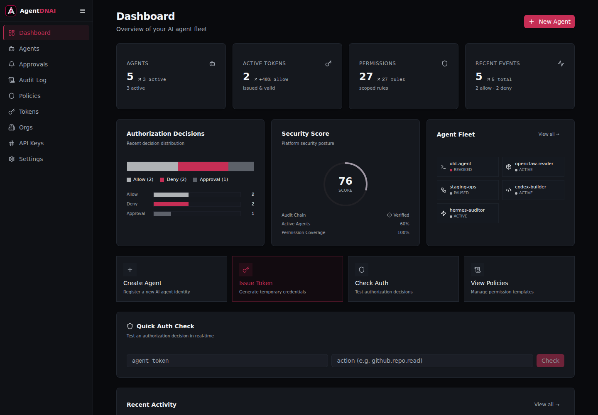
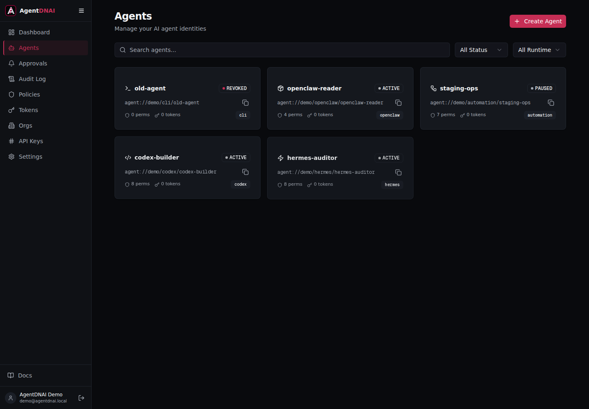
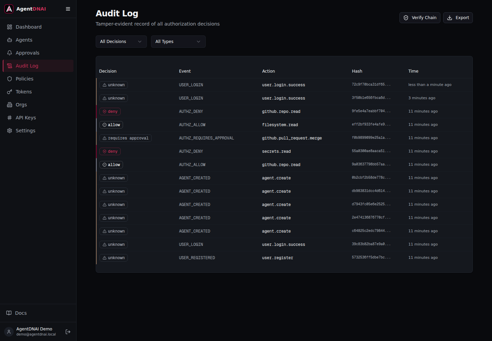

<div align="center">


**Identidad digital y control de acceso para agentes de IA**

[English](./README.md) · [Español](./README.es.md)

[](./LICENSE)
[](https://github.com/smouj/agentdnai)
[](https://nextjs.org/)
[](https://www.typescriptlang.org/)
[](https://www.prisma.io/)
[](https://www.docker.com/)

[Instalacion](#-instalacion) · [Inicio Rapido](#-inicio-rapido) · [Capturas](#capturas) · [CLI](#-cli) · [SDK](#-sdk) · [API](#-referencia-api) · [Documentacion](./docs)

</div>

---

**AgentDNAI** es un sistema de identidad digital y control de acceso para agentes de IA. Cada agente recibe una identidad verificable (DNI), permisos granulares, tokens temporales y una auditoria resistente a manipulaciones. Las acciones de produccion requieren aprobacion humana. La revocacion es inmediata.

## Por Que AgentDNAI

Los agentes de IA leen repositorios, modifican archivos, crean PRs, acceden a secretos y automatizan infraestructura. Sin una capa de identidad, son dificiles de controlar, auditar y revocar.

| Sin AgentDNAI | Con AgentDNAI |
|---|---|
| Agentes anonimos | Cada agente tiene URI unica, par de claves RSA-PSS y fingerprint |
| Acceso demasiado amplio | Reglas ALLOW, DENY y REQUIRES_APPROVAL por recurso |
| Sin historial fiable | Audit log append-only con hash chain y secuencia |
| API keys permanentes | Tokens de vida corta, hasheados con HMAC y pepper |
| Produccion sin barreras | Las acciones productivas requieren aprobacion humana |
| Sin equipos ni ownership | Usuarios, organizaciones, roles y fronteras multitenant |
| Integracion dificil | SDK TypeScript, CLI y API REST |

## Capturas

Capturas reales tomadas desde la app en ejecucion con datos demo sembrados.

| Dashboard | Agentes |
|---|---|
|  |  |

| Audit Log |
|---|
|  |

## Casos De Uso

| Caso | Como ayuda AgentDNAI |
|---|---|
| Acceso a repositorios | Permite `github.repo.read` y deniega `production.deploy` para agentes de auditoria |
| Deploys productivos | `production.deploy` requiere aprobacion humana antes de ejecutar |
| Escaneo de secretos | Tokens de 60s a 24h para evitar credenciales permanentes |
| Monitorizacion de infraestructura | Lectura permitida, escritura y reinicios sujetos a reglas |
| Code review | Wildcards como `github.repo.*` con DENY explicito donde importa |

## Funcionalidades

- **Identidad de agente**: URI unica (`agent://org/runtime/name`), RSA-PSS, fingerprint, entorno y ciclo de vida.
- **Autenticacion de usuario**: registro, login, sesiones en DB y passwords con Argon2id.
- **Organizaciones**: equipos con roles `OWNER`, `ADMIN`, `SECURITY_MANAGER`, `DEVELOPER` y `VIEWER`.
- **Permisos granulares**: 47 permisos en 9 categorias, con ALLOW, DENY y REQUIRES_APPROVAL.
- **Tokens seguros**: HMAC-SHA256 con pepper, comparacion timing-safe, TTL obligatorio y raw tokens nunca almacenados.
- **Auditoria verificable**: audit log append-only con hash chain, numeros de secuencia y verificacion de integridad.
- **Motor de politicas**: deny-by-default, DENY prevalece, wildcards y aprobacion para acciones destructivas/productivas.
- **Cola de aprobaciones**: flujo de solicitud, aprobacion y rechazo.
- **Proteccion BOLA**: checks de ownership por usuario y organizacion en rutas criticas.
- **Risk scoring**: calculo de riesgo 0-100 por agente.
- **Eventos en tiempo real**: WebSocket y SSE para eventos de seguridad.
- **CLI y SDK**: integracion por terminal y TypeScript.
- **Docker**: Compose local y produccion con secretos obligatorios.
- **Ejemplos**: wrappers para OpenClaw, Codex, Cursor, Hermes y Aider.

## Instalacion

### Opcion 1: Docker Compose

```bash
git clone https://github.com/smouj/agentdnai.git
cd agentdnai
cp .env.example .env
docker compose up -d
```

Abre `http://localhost:3000` y crea tu cuenta.

### Opcion 2: Desarrollo Local

```bash
# Requisitos: Bun >= 1.0 o Node.js >= 18
git clone https://github.com/smouj/agentdnai.git
cd agentdnai
bun install
cp .env.example .env
bun run db:push
bun run dev
```

Abre `http://localhost:3000`.

## Inicio Rapido

### 1. Registro y Login

```bash
curl -X POST http://localhost:3000/api/auth/register \
  -H "Content-Type: application/json" \
  -d '{"email":"you@example.com","password":"SecurePass123","name":"Your Name"}'

curl -X POST http://localhost:3000/api/auth/login \
  -H "Content-Type: application/json" \
  -d '{"email":"you@example.com","password":"SecurePass123"}'
```

Guarda el token de sesion devuelto por el login para las llamadas autenticadas.

### 2. Crear Un Agente

```bash
curl -X POST http://localhost:3000/api/agents \
  -H "Content-Type: application/json" \
  -H "Authorization: Bearer <session-token>" \
  -d '{
    "name": "repo-auditor",
    "runtime": "codex",
    "environment": "development",
    "description": "Read-only repository auditor"
  }'
```

### 3. Conceder Permisos

```bash
curl -X POST http://localhost:3000/api/agents/<agent-id>/permissions \
  -H "Content-Type: application/json" \
  -H "Authorization: Bearer <session-token>" \
  -d '{"scope":"github.repo.read","resource":"github.com/org/repo","effect":"ALLOW"}'

curl -X POST http://localhost:3000/api/agents/<agent-id>/permissions \
  -H "Content-Type: application/json" \
  -H "Authorization: Bearer <session-token>" \
  -d '{"scope":"production.*","resource":"*","effect":"DENY"}'
```

### 4. Emitir Un Token Temporal

```bash
curl -X POST http://localhost:3000/api/tokens/issue \
  -H "Content-Type: application/json" \
  -H "Authorization: Bearer <session-token>" \
  -d '{
    "agentId": "<agent-id>",
    "scopes": ["github.repo.read"],
    "ttlSeconds": 3600
  }'
```

### 5. Verificar Autorizacion

```bash
curl -X POST http://localhost:3000/api/authz/check \
  -H "Content-Type: application/json" \
  -H "Authorization: Bearer <agent-token>" \
  -d '{"action":"github.repo.read","resource":"github.com/org/repo"}'
```

La API valida token real, hash/HMAC, TTL, revocacion, agente, scopes efectivos y motor de politicas. El cliente no puede inventar scopes y tratarlos como verdad.

## Modelo De Seguridad

AgentDNAI aplica una frontera de seguridad basada en usuario, organizacion, agente y token:

- Los recursos se resuelven desde `session.userId` y organizacion activa.
- Los campos sensibles de ownership no se confian al cliente.
- `DENY` prevalece sobre `ALLOW`.
- Las operaciones destructivas o productivas requieren aprobacion.
- Los tokens expirados o revocados no autorizan.
- Los passwords usan Argon2id con formato versionado.
- Los tokens de alta entropia se almacenan como HMAC con pepper.
- El audit log usa hash chain para detectar manipulacion.

## Referencia API

| Metodo | Ruta | Descripcion |
|---|---|---|
| `POST` | `/api/auth/register` | Crear usuario |
| `POST` | `/api/auth/login` | Iniciar sesion |
| `GET` | `/api/auth/me` | Usuario actual |
| `GET` | `/api/agents` | Listar agentes accesibles |
| `POST` | `/api/agents` | Crear agente |
| `GET` | `/api/agents/:id` | Detalle de agente |
| `PATCH` | `/api/agents/:id` | Actualizar agente |
| `DELETE` | `/api/agents/:id` | Revocar/eliminar agente segun flujo |
| `POST` | `/api/agents/:id/permissions` | Crear permiso |
| `POST` | `/api/tokens/issue` | Emitir token temporal |
| `POST` | `/api/tokens/:id/revoke` | Revocar token |
| `POST` | `/api/authz/check` | Verificar una accion con token real |
| `POST` | `/api/authz/batch-check` | Verificar acciones en lote |
| `GET` | `/api/audit` | Consultar audit log |
| `GET` | `/api/export` | Exportar datos accesibles |
| `POST` | `/api/import` | Importar datos permitidos |
| `GET` | `/api/stats` | Estadisticas del workspace |

Consulta [docs/API_REFERENCE.md](./docs/API_REFERENCE.md) para la referencia detallada.

## CLI

```bash
npm install -g @agentdnai/cli

agentdnai config set api.url http://localhost:3000
agentdnai config set auth.token <session-token>

agentdnai agent create repo-auditor --runtime codex
agentdnai perm grant repo-auditor github.repo.read --effect ALLOW
agentdnai token issue repo-auditor --scopes github.repo.read --ttl 3600
agentdnai check repo-auditor github.repo.read --resource github.com/org/repo
agentdnai audit verify
```

## SDK

```ts
import { AgentDNAI } from '@agentdnai/sdk';

const agentdnai = new AgentDNAI({
  baseUrl: 'http://localhost:3000',
  token: process.env.AGENTDNAI_TOKEN!,
});

const agent = await agentdnai.agents.create({
  name: 'repo-auditor',
  runtime: 'codex',
  environment: 'development',
});

const result = await agentdnai.authz.check({
  action: 'github.repo.read',
  resource: 'github.com/org/repo',
});

console.log(result.decision);
```

## Variables De Entorno

| Variable | Uso |
|---|---|
| `DATABASE_URL` | SQLite en desarrollo o PostgreSQL en produccion |
| `AUTH_PEPPER` | Pepper para hashes de autenticacion |
| `TOKEN_PEPPER` | Pepper para HMAC de tokens |
| `MAX_TOKEN_TTL` | TTL maximo de tokens |
| `MIN_TOKEN_TTL` | TTL minimo de tokens |
| `ALLOW_DEMO_SEED` | Habilita datos demo solo en desarrollo |
| `REDIS_URL` | Rate limiting/cache compartidos en despliegues distribuidos |
| `NEXT_PUBLIC_APP_URL` | URL publica de la app |

Genera secretos reales con:

```bash
openssl rand -hex 32
```

## Calidad Y Verificacion

Comandos recomendados antes de abrir PR o desplegar:

```bash
bun install --frozen-lockfile
DATABASE_URL=file:./prisma/ci.db bunx prisma validate
bun run lint
bun run typecheck
bun run test
bun run build
```

## Estado Del Proyecto

AgentDNAI esta en la rama `v0.2` de hardening de produccion. La prioridad es mantener una frontera verificable entre usuario, organizacion, agente y token antes de ampliar funcionalidades.

Checklist minimo para considerarlo production-ready:

```text
[ ] 0 accesos cross-tenant conocidos
[ ] 0 campos de ownership confiados al cliente
[ ] AuthZ valida credenciales reales
[ ] Passwords con KDF resistente
[ ] Tests multiusuario automatizados
[ ] Docker build limpio desde cero
[ ] PostgreSQL probado
[ ] Rate limiting compartido
[ ] Secrets de produccion obligatorios
[ ] Docs = implementacion
[ ] SDK + CLI incluidos en CI
[ ] Audit chain segura bajo concurrencia
```

## Documentacion

- [Architecture](./ARCHITECTURE.md)
- [Security](./SECURITY.md)
- [Interface System](./docs/INTERFACE_SYSTEM.md)
- [API Reference](./docs/API_REFERENCE.md)
- [Getting Started](./docs/GETTING_STARTED.md)
- [Deployment Local](./docs/DEPLOYMENT_LOCAL.md)
- [Deployment Production](./docs/DEPLOYMENT_PRODUCTION.md)
- [Roadmap](./docs/ROADMAP.md)

## Contribuir

Las contribuciones son bienvenidas. Revisa [CONTRIBUTING.md](./CONTRIBUTING.md) antes de abrir una PR. Las vulnerabilidades de seguridad no deben reportarse como issues publicas; usa el flujo de [SECURITY.md](./SECURITY.md).

## Licencia

Este repositorio es software propietario source-available. Se permite revision, evaluacion local y contribuciones upstream; redistribucion, reventa, uso hospedado para terceros, relicenciamiento y reutilizacion de marca/logo requieren permiso previo por escrito. Consulta [LICENSE](./LICENSE).

---

<div align="center">

**AgentDNAI** — Identifica cada agente. Controla cada accion. Audita cada decision.

[Issues](https://github.com/smouj/agentdnai/issues) · [Documentacion](./docs) · [Seguridad](./SECURITY.md)

</div>
