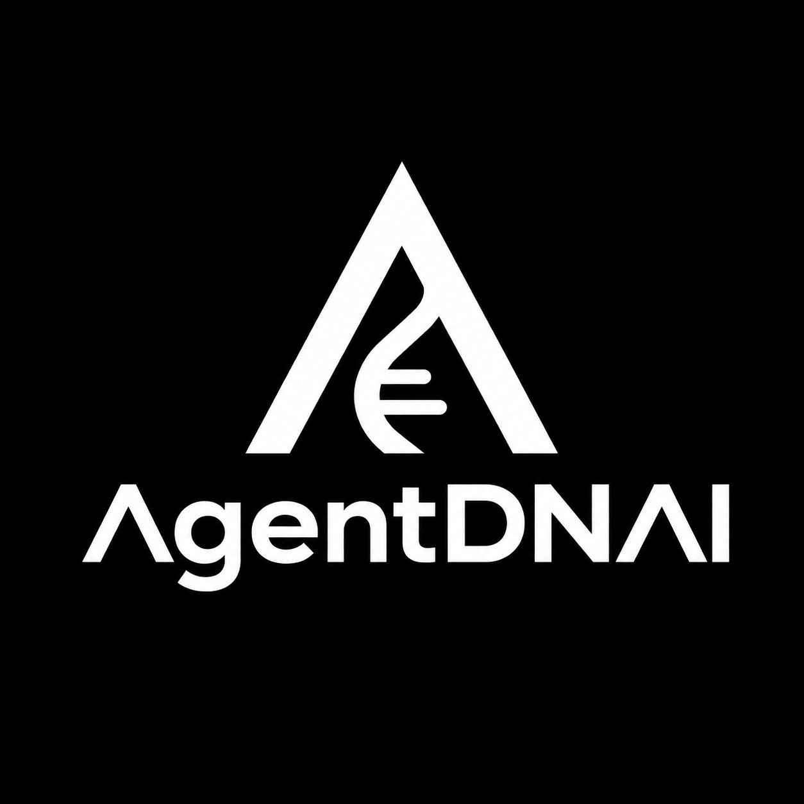

<div align="center">



**Digital Identity & Access Control for AI Agents**

[](https://opensource.org/licenses/MIT)
[](https://github.com/smouj/agentdnai)
[](https://nextjs.org/)
[](https://www.typescriptlang.org/)
[](https://www.prisma.io/)
[](https://www.docker.com/)

[Installation](#-installation) · [Quick Start](#-quick-start) · [CLI](#-cli) · [SDK](#-sdk) · [API Reference](#-api-reference) · [Documentation](./docs)

</div>

---

**AgentDNAI** is the digital identity and access control system for AI agents. Every agent gets a verifiable identity (DNI), scoped permissions, temporary tokens, and a tamper-evident audit trail. Production actions require human approval. Revocation is instant.

## Why AgentDNAI?

AI agents read repositories, modify files, create PRs, access secrets and automate infrastructure. Without a proper identity layer, they become hard to control, hard to audit and hard to revoke.

| Without AgentDNAI | With AgentDNAI |
|---|---|
| ❌ Agents operate anonymously | ✅ Every agent has a unique URI + RSA-PSS key pair + fingerprint |
| ❌ Agents get blanket access | ✅ Granular allow/deny rules per resource with wildcards |
| ❌ No record of what agents did | ✅ Hash-chained, append-only audit log with sequence numbers |
| ❌ Permanent API keys that leak | ✅ Short-lived, HMAC-hashed tokens with pepper |
| ❌ Production actions unguarded | ✅ Production always requires human approval |
| ❌ No user accounts or teams | ✅ Users, organizations, roles, and ownership |
| ❌ No way to integrate | ✅ TypeScript SDK + CLI + REST API |

## ✨ Features

- **🔐 Agent Identity (DNI)** — Unique URI (`agent://org/runtime/name`), RSA-PSS key pair, fingerprint, environment, and lifecycle status
- **👤 User Authentication** — Register, login, sessions with HMAC-SHA256 password hashing
- **🏢 Organizations** — Teams with roles: OWNER, ADMIN, SECURITY_MANAGER, DEVELOPER, VIEWER
- **🛡️ Scoped Permissions** — 47 granular permissions across 9 categories, with ALLOW / DENY / REQUIRES_APPROVAL effects and wildcard support
- **🔑 Secure Tokens** — HMAC-SHA256 with pepper, timing-safe comparison, TTL (60s–24h), raw tokens never stored
- **📜 Audit Trail** — Hash-chained append-only log with sequence numbers and integrity verification
- **⚖️ Policy Engine** — Deny-by-default, DENY always wins, wildcard patterns, production/destructive actions require approval
- **🚦 Approval Queue** — Request, approve, reject workflow for actions requiring human review
- **🔒 OWASP BOLA Protection** — Ownership checks on every agent/org endpoint
- **📊 Risk Scoring** — 7-factor risk assessment (0–100 scale) per agent
- **⚡ Real-time Events** — WebSocket + SSE live security event feed
- **⌨️ CLI** — Full command-line interface with 16 commands
- **📦 SDK** — TypeScript SDK for programmatic integration
- **🐳 Docker** — Docker Compose for local and production deployment
- **🧩 Integration Examples** — OpenClaw, Codex, Cursor, Hermes, Aider wrappers

## 📦 Installation

### Option 1: Docker Compose (Recommended)

```bash
git clone https://github.com/smouj/agentdnai.git
cd agentdnai
cp .env.example .env
docker compose up -d
```

Open http://localhost:3000 and create your account.

### Option 2: Local Development

```bash
# Prerequisites: Bun ≥ 1.0 or Node.js ≥ 18

git clone https://github.com/smouj/agentdnai.git
cd agentdnai
bun install
cp .env.example .env
bun run db:push
bun run dev
```

Open http://localhost:3000 in your browser.

## 🚀 Quick Start

### 1. Register & Login

```bash
# Register a new account
curl -X POST http://localhost:3000/api/auth/register \
  -H "Content-Type: application/json" \
  -d '{"email":"you@example.com","password":"SecurePass123","name":"Your Name"}'

# Login
curl -X POST http://localhost:3000/api/auth/login \
  -H "Content-Type: application/json" \
  -d '{"email":"you@example.com","password":"SecurePass123"}'
```

### 2. Create an Agent

```bash
curl -X POST http://localhost:3000/api/agents \
  -H "Content-Type: application/json" \
  -H "Authorization: Bearer <your-session-token>" \
  -d '{"name":"repo-auditor","runtime":"openclaw","description":"Repository audit agent"}'
```

### 3. Grant Permissions

```bash
curl -X POST http://localhost:3000/api/agents/{agentId}/permissions \
  -H "Content-Type: application/json" \
  -H "Authorization: Bearer <your-session-token>" \
  -d '{"scope":"github.repo.read","effect":"ALLOW"}'
```

### 4. Issue a Token

```bash
curl -X POST http://localhost:3000/api/tokens/issue \
  -H "Content-Type: application/json" \
  -H "Authorization: Bearer <your-session-token>" \
  -d '{"agentId":"{agentId}","scopes":["github.repo.read"],"ttlSeconds":3600}'
```

### 5. Check Authorization

```bash
curl -X POST http://localhost:3000/api/authz/check \
  -H "Content-Type: application/json" \
  -d '{"agentId":"{agentId}","action":"github.repo.read"}'
# → {"allowed":true,"decision":"allow","reason":"Explicit permission found for this action."}

curl -X POST http://localhost:3000/api/authz/check \
  -H "Content-Type: application/json" \
  -d '{"agentId":"{agentId}","action":"production.deploy"}'
# → {"allowed":false,"decision":"requires_approval","reason":"Production actions require human approval."}
```

### 6. Verify Audit Chain

```bash
curl http://localhost:3000/api/audit/verify
# → {"valid":true,"eventsChecked":12,"message":"Audit chain is intact"}
```

## ⌨️ CLI

```bash
# Install CLI
bun install

# Login
bun packages/cli/index.ts login

# Register an agent
bun packages/cli/index.ts agents:list
bun packages/cli/index.ts agents:show <agent-id>

# Issue a token
bun packages/cli/index.ts token:issue <agent-id> --ttl 3600 --scopes "github.repo.read"

# Check authorization
bun packages/cli/index.ts authz:check --agent <agent-id> --action github.repo.read

# Verify audit chain
bun packages/cli/index.ts audit:verify
```

## 📦 SDK

```typescript
import { AgentDNAIClient } from '@agentdnai/sdk';

const agentdnai = new AgentDNAIClient({
  baseUrl: process.env.AGENTDNAI_URL || 'http://localhost:3000',
  token: process.env.AGENTDNAI_TOKEN,
});

// Check authorization before any agent action
const decision = await agentdnai.authz.check({
  agentId: 'your-agent-id',
  action: 'github.repo.read',
  resource: 'github.com/org/repo',
});

if (!decision.allowed) {
  throw new Error(`Action blocked: ${decision.reason}`);
}

// Issue a token
const token = await agentdnai.tokens.issue({
  agentId: 'your-agent-id',
  scopes: ['github.repo.read'],
  ttlSeconds: 3600,
});

// Verify audit integrity
const result = await agentdnai.audit.verify();
console.log(`Audit chain: ${result.valid ? 'VALID' : 'INVALID'}`);
```

## 🏗️ Architecture

```
┌─────────────────────────────────────────────────────────────┐
│                    AgentDNAI Platform                        │
│  ┌──────────┐  ┌──────────┐  ┌──────────┐  ┌───────────┐  │
│  │  Landing  │  │ Dashboard│  │   CLI    │  │    SDK    │  │
│  │   Page    │  │ + DNI    │  │ 16 cmds  │  │ TypeScript│  │
│  │           │  │  Card    │  │          │  │           │  │
│  └──────────┘  └──────────┘  └──────────┘  └───────────┘  │
├─────────────────────────────────────────────────────────────┤
│                    API Routes (35+)                          │
│  ┌─────────┐ ┌──────────┐ ┌──────┐ ┌──────┐ ┌──────────┐  │
│  │  Auth   │ │  Agents  │ │Tokens│ │Authz │ │  Audit   │  │
│  │Register │ │ CRUD+    │ │Issue │ │Check │ │Log+Verify│  │
│  │Login    │ │Risk/     │ │Revoke│ │Batch │ │Chain+    │  │
│  │Sessions │ │Health    │ │      │ │      │ │Export    │  │
│  └─────────┘ └──────────┘ └──────┘ └──────┘ └──────────┘  │
│  ┌──────────┐ ┌──────────┐ ┌───────────┐                   │
│  │  Orgs    │ │Approvals │ │  Stats/   │                   │
│  │Members   │ │Approve/  │ │  Activity │                   │
│  │Roles     │ │Reject    │ │  Trends   │                   │
│  └──────────┘ └──────────┘ └───────────┘                   │
├─────────────────────────────────────────────────────────────┤
│                   Core Libraries                             │
│  ┌──────────┐ ┌───────────┐ ┌──────┐ ┌──────┐ ┌────────┐  │
│  │ Crypto   │ │ Policy    │ │Audit │ │Tokens│ │Ownership│  │
│  │ RSA-PSS  │ │ Engine    │ │Hash  │ │HMAC  │ │ BOLA   │  │
│  │ HMAC     │ │ Wildcards │ │Chain │ │Pepper│ │ Checks │  │
│  └──────────┘ └───────────┘ └──────┘ └──────┘ └────────┘  │
├─────────────────────────────────────────────────────────────┤
│          Prisma ORM + SQLite (dev) / PostgreSQL (prod)       │
│  User → Organization → OrganizationMember                   │
│       → AgentIdentity → AgentPermission → AgentToken        │
│       → ApprovalRequest → AuditEvent (hash-chained)         │
│       → Session → ApiKey → WebhookEndpoint                  │
└─────────────────────────────────────────────────────────────┘
```

### Security Model

| Principle | Implementation |
|---|---|
| **Deny by Default** | Everything is denied unless explicitly allowed |
| **DENY Always Wins** | If any DENY rule matches, the action is denied regardless of ALLOW rules |
| **Least Privilege** | Agents receive only the minimum permissions needed |
| **Immediate Revocation** | Pause, revoke or block any agent instantly |
| **Temporary Tokens** | No permanent tokens. TTL is mandatory (60s–24h) |
| **Production Guarded** | Production and destructive actions always require human approval |
| **Audit Integrity** | Hash-chained append-only log with sequence numbers detects tampering |
| **Token Hashing** | Raw tokens never stored — only HMAC-SHA256 hashes with pepper |
| **BOLA Protection** | Ownership checks on every agent/organization endpoint (OWASP API1:2023) |
| **Rate Limiting** | In-memory per-IP rate limiting for authentication endpoints |

## 📡 API Reference

### Authentication

| Method | Endpoint | Description |
|---|---|---|
| `POST` | `/api/auth/register` | Register new account (creates user + personal org) |
| `POST` | `/api/auth/login` | Login with email/password |
| `POST` | `/api/auth/logout` | Invalidate session |
| `GET` | `/api/auth/me` | Get current user + organizations |

### Organizations

| Method | Endpoint | Description |
|---|---|---|
| `GET` | `/api/orgs` | List user's organizations |
| `POST` | `/api/orgs` | Create organization |
| `GET` | `/api/orgs/{id}` | Get organization details |
| `PATCH` | `/api/orgs/{id}` | Update organization |
| `DELETE` | `/api/orgs/{id}` | Delete organization |
| `GET` | `/api/orgs/{id}/members` | List members |
| `POST` | `/api/orgs/{id}/members` | Add member |
| `DELETE` | `/api/orgs/{id}/members` | Remove member |

### Agents

| Method | Endpoint | Description |
|---|---|---|
| `POST` | `/api/agents` | Create a new agent |
| `GET` | `/api/agents` | List agents (with search/filter) |
| `GET` | `/api/agents/{id}` | Get agent details |
| `DELETE` | `/api/agents/{id}` | Delete an agent |
| `POST` | `/api/agents/{id}/revoke` | Revoke agent identity |
| `POST` | `/api/agents/{id}/pause` | Pause agent |
| `POST` | `/api/agents/{id}/resume` | Resume paused agent |
| `POST` | `/api/agents/{id}/rotate-key` | Rotate agent key pair |
| `POST` | `/api/agents/{id}/approve` | Approve pending action |
| `GET` | `/api/agents/{id}/risk` | Get risk score (7-factor) |
| `GET` | `/api/agents/{id}/health` | Health check |

### Permissions, Tokens, Authz, Audit, Approvals

See [API Reference](./docs/API_REFERENCE.md) for complete documentation.

### System

| Method | Endpoint | Description |
|---|---|---|
| `GET` | `/api/health` | Health check (no auth) |
| `GET` | `/api/version` | Version info (no auth) |

## 🛠️ Tech Stack

| Layer | Technology |
|---|---|
| **Framework** | Next.js 16 (App Router) |
| **Language** | TypeScript 5 |
| **Styling** | Tailwind CSS 4 + shadcn/ui |
| **Database** | Prisma ORM (SQLite dev / PostgreSQL prod) |
| **Auth** | Custom sessions with HMAC-SHA256 password hashing |
| **Cryptography** | RSA-PSS key pairs, HMAC-SHA256 tokens with pepper |
| **Animations** | Framer Motion |
| **Charts** | Recharts |
| **Real-time** | Socket.io (WebSocket) + SSE fallback |
| **Validation** | Zod |
| **State** | Zustand |
| **CLI** | Commander.js |
| **Deploy** | Docker Compose + Caddy |

## 📁 Project Structure

```
agentdnai/
├── prisma/schema.prisma       # Database schema (12 models)
├── src/
│   ├── app/
│   │   ├── api/               # 35+ API route handlers
│   │   │   ├── auth/          # Register, Login, Logout, Me
│   │   │   ├── orgs/          # Organizations + Members
│   │   │   ├── agents/        # Agent CRUD + lifecycle + risk + health
│   │   │   ├── tokens/        # Token issue/revoke
│   │   │   ├── authz/         # Authorization checks + batch
│   │   │   ├── approvals/     # Approval queue
│   │   │   ├── audit/         # Audit log + verify + export
│   │   │   ├── stats/         # Statistics + trends
│   │   │   ├── activity/      # Activity heatmap data
│   │   │   ├── events/        # SSE event stream
│   │   │   ├── health/        # Health check
│   │   │   └── version/       # Version info
│   │   ├── globals.css        # Theme + animations
│   │   ├── layout.tsx         # Root layout
│   │   └── page.tsx           # SPA (11+ views)
│   ├── components/ui/         # shadcn/ui components
│   └── lib/
│       ├── api-client.ts      # TypeScript API client
│       ├── api-error.ts       # Standardized API errors
│       ├── audit.ts           # Hash chain audit logger
│       ├── auth.ts            # Authentication + sessions
│       ├── crypto.ts          # RSA-PSS, HMAC-SHA256, key gen
│       ├── db.ts              # Prisma client instance
│       ├── ownership.ts       # BOLA protection + role checks
│       ├── permissions.ts     # 47 permissions, 10 templates
│       ├── policy.ts          # Authorization engine + wildcards
│       ├── rate-limit.ts      # In-memory rate limiting
│       ├── schemas.ts         # Zod validation schemas
│       ├── store.ts           # Zustand navigation + auth store
│       └── tokens.ts          # Token lifecycle with HMAC
├── packages/
│   ├── cli/                   # AgentDNAI CLI (16 commands)
│   └── sdk/                   # TypeScript SDK
├── examples/
│   ├── openclaw-agent/        # OpenClaw integration example
│   ├── codex-safe-runner/     # Codex integration example
│   └── dev-agent-wrapper/     # Generic dev agent wrapper
├── docs/                      # Documentation
├── mini-services/event-service/ # WebSocket service (port 3003)
├── Dockerfile                 # Multi-stage Docker build
├── docker-compose.yml         # Local deployment
├── docker-compose.prod.yml    # Production (PostgreSQL+Redis+Caddy)
└── .github/workflows/ci.yml   # GitHub Actions CI
```

## 🗺️ Roadmap

| Version | Status | Focus |
|---|---|---|
| **v0.2.1** | ✅ Current | Security hardening, auth, orgs, real crypto, CLI, SDK, Docker |
| **v0.3.0-alpha** | 🔜 Next | Onboarding UX, agent DNI card, integrations, tests |
| **v0.4.0-beta** | 📋 Planned | Invitations, advanced audit, metrics, backups |
| **v1.0.0** | 🎯 Goal | Production-ready, security audited, stable API, full docs |

See [ROADMAP.md](./docs/ROADMAP.md) for details.

## 🤝 Contributing

Contributions are welcome! Please see [CONTRIBUTING.md](./CONTRIBUTING.md) for guidelines.

## 📄 License

This project is licensed under the MIT License — see [LICENSE](./LICENSE) for details.

---

<div align="center">

**AgentDNAI** — Know every agent. Control every action. Audit every decision.

[🐛 Issues](https://github.com/smouj/agentdnai/issues) · [📖 Documentation](./docs) · [🔒 Security](./SECURITY.md)

</div>
